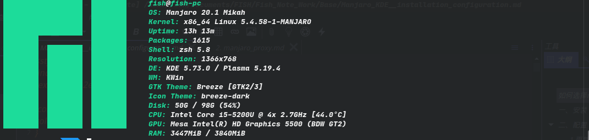
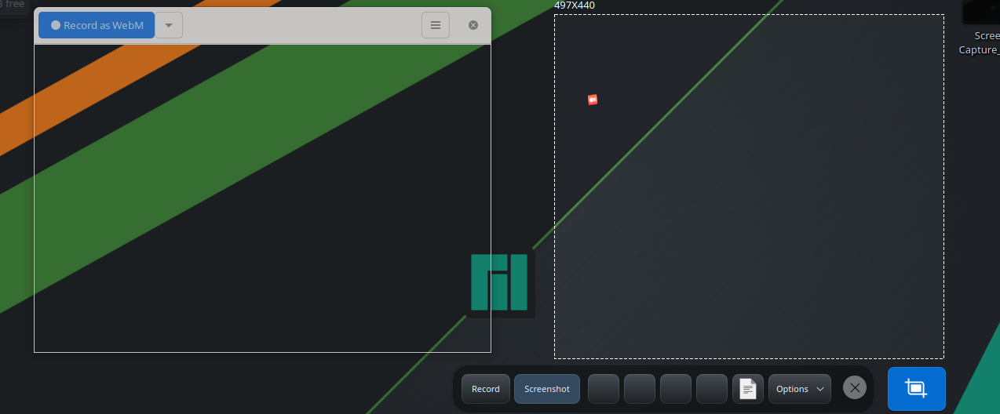
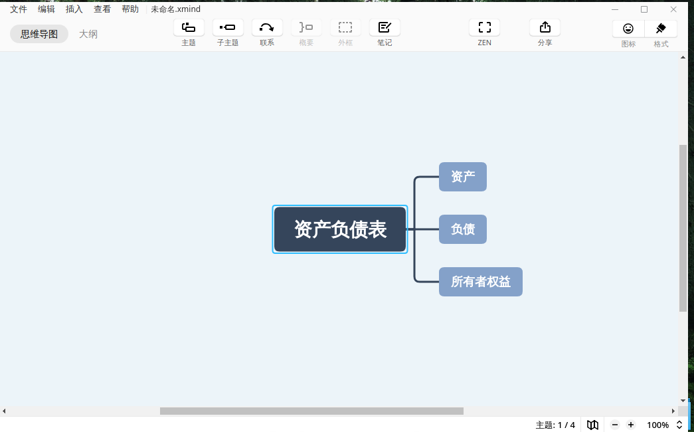
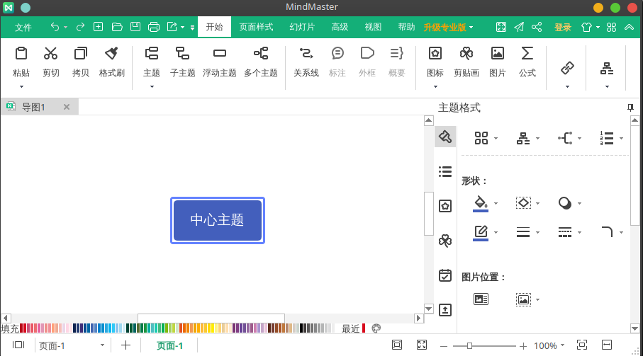
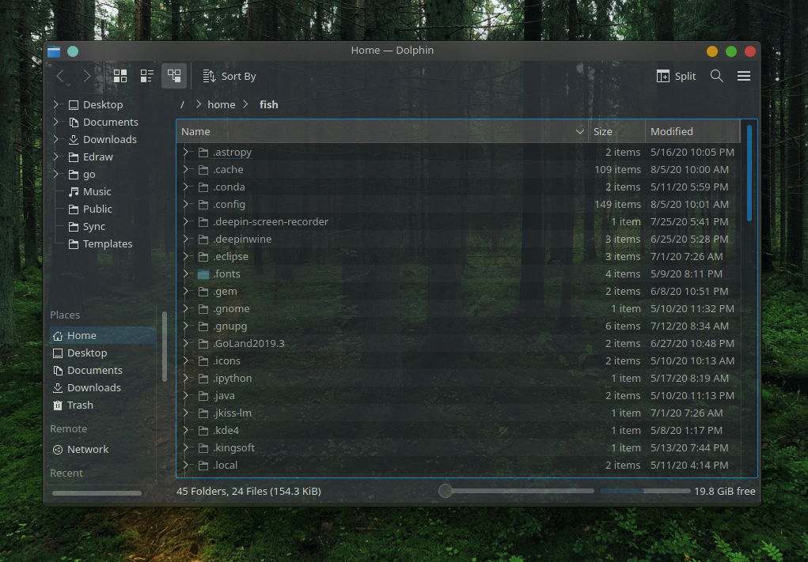
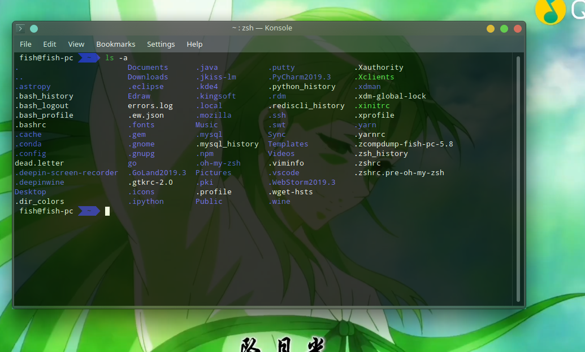
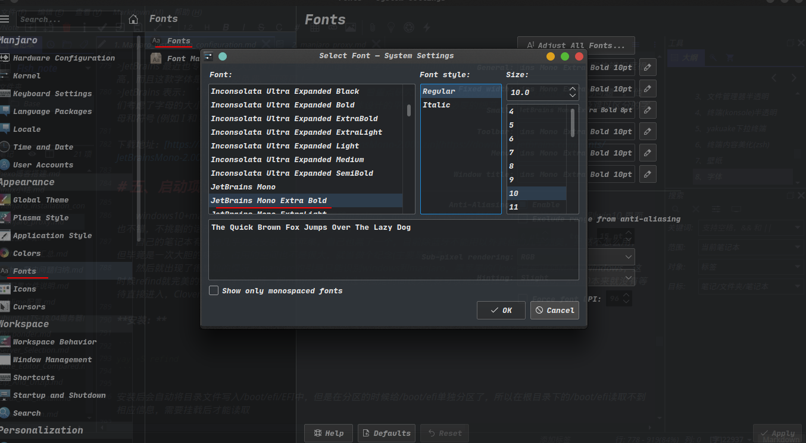
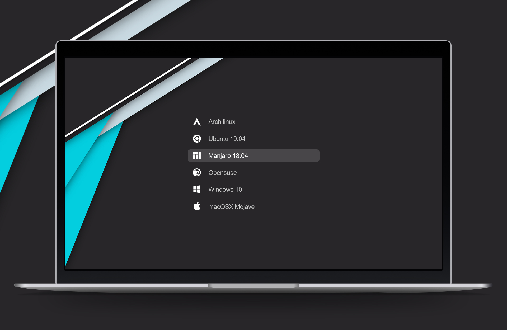
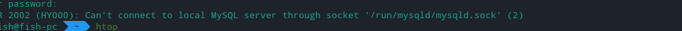
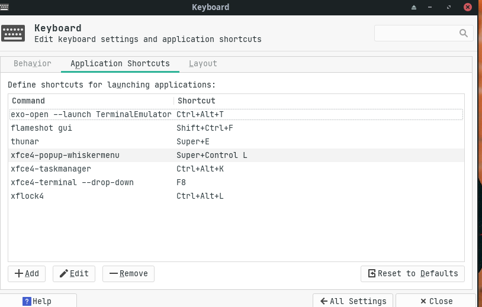

Title: Manjaro 的选择、安装、配置
Category: System
tags: linux,manjaro
Date: 2020-9-03 10:20


<style>
.ind {
text-indent: 2em;
}
.col {
color: red;
}
</style>

# ！！！ 如何选择manajro

<p class='ind'> 现在有 Xfce 、GNOME 和 KDE Plasma 作为默认桌面环境的3个版本，桌面环境差异不是很大，主要差异为如果按照桌面的轻量级排序 Xfce > GNOME > KDE Plasma 。</p>
<p class='ind'> Xfce 是最轻量的，比较老的电脑可以选择这个。</p>
<p class='ind'>GNOME 是以前使用比较多的桌面环境，但随着硬件设备的发展，基本都有在向着 KDE 发展。 </p>
<p class='ind'> KDE 版本 最明显的当然是它的华丽了，很多的桌面修改不用额外去安装、直接在设置里面修改就有很惊艳的效果。</p>

以下就以我自己的配置为例


<p class='ind'>此次安装的为 KDE 版本，正常使用的话没有问题，但是在后期设置了不少软件自启，以及桌面装饰 dock 和其他一些美化后，整个使用体验就大幅下降，时不时就卡顿一下，去掉了不必要的配置能够保证正常的使用了，而且虽然 dock 的软件只有几M，但是在运行后是很占空间的。</p>

找了一些更为详细的介绍，可以参考一下。

> KDE 是一个容易使用的现代桌面环境。 KDE 有很多很好的特性：
> 一个美丽的现代的桌面。
> 一个集合了完美网络环境的桌面。
> 一个集成的帮助系统，能够方便、高效地帮助您使用 KDE 桌面和它的应用程序。
> 所有的 KDE 应用程序具有一致的所见即所得界面。
> 标准的菜单和工具栏，键盘布局，颜色配置等。
> 国际化：KDE 可以使用超过40种语言。
> 集中化、 统一的对话框驱动的桌面配置
> 许多有用的 KDE 应用程序。
> Ubuntu 默认桌面环境采用 unity, Kubuntu 则是 KDE（K桌面环境，K Desktop Environment)。Kubuntu 项目为 Ubuntu 用户提供了一个默认 unity 桌面环境之外的选择。感谢 Kubuntu 项目小组的努力，Ubuntu 用户现在可以在自己的系统上轻易安装和使用 KDE 桌面。欲在 Ubuntu 基础上安装上一个可用的 Kubuntu，您须安装kubuntu-desktop 软件包。安装该软件包后，您就可以任意选择使用 Gnome 和 KDE 桌面环境。
>
>
> GNOME 是 The GNU Network Object Model Environment 的缩写，意思是 GNU 网络对象模型环境，1997年8月，GNU GNOME 计划正式启动，之后经过大约一年的发展，在整个世界范围内估计有二百名程序员参与了这个计划的开发工作。最初召集开发者的通告通过多个讨论组规划了 GNOME 计划。GNOME 计划的目标是完全基于自由软件，构造一个功能完善、操作简单以及界面友好的桌面环境，而不必面对毫无生气的文本环境。GNOME 是 GNU 计划的一部分，同时也是 Open Source（开放源码）运动一个重要的组成部分，GNOME 以GTK+ 作为 GUI 图形开发工具包开发了许多小工具和大量的应用软件，GNOME 努力以真正自由的 GTK 作底层去实现与 KDE 相同的功能，并努力超越 KDE。
> 严格来说 GNOME 不仅仅是一个简单的窗口管理器，它为用户提供了一个功能强大、界面友好的桌面操作环境，GNOME 包括一个面板、桌面以及一系列标准的桌面工具和很多功能强大的应用软件，这些应用软件包括：文件管理器 GMC、能和 PhotoShop 相媲美的 GNU 图像处理软件 GIMP、电子表格处理软件 Gnumeric、字处理软件 AbiWord 等。现在开放源码的 StarOffice 办公套装已经融入 GNOME 中，成为其办公软件套装的核心部分。此外，GNOME 也提供传统的应用软件，像邮件阅读器、MP3 播放器以及简单的编辑器等。这些应用软件大大提高了 Linux 系统的可操作性，并且 GNOME 支持鼠标拖放机制，以最大限度实现与其它应用程序的交互性操作。
> 虽然 GNOME 是一个独立运行的桌面环境，并不需要其它窗口管理器来控制应用程序以及其它交互式的操作，但 GNOME 可以和其它窗口管理器协作使用，使用户感觉到这些窗口管理器能更好地融入桌面，发挥它们最大的功能。GNOME 默认的窗口管理器是 Enlightenment，最近推出的GNOME 默认窗口管理器是 Sawfish（也就是以前的 Sawmill ），因为 GNOME + Enlightenment 将占用很大的资源，而且 GNOME 和 Enlightenment 之间有很多相同的功能。
>
>Xfce 是一个运行在各类Unix下的轻量级桌面环境，它类似于商业图形环境 CDE。它的作者是 Olivier Fourdan。两年以前，Olivier Fourdan 试图寻找一个快速、友好、高效的Linux 桌面，于是 XFce 就这样诞生了。XFce 最先是基于 XForms 三维图形库，随后又开发了一些后续版本。Olivier Fourdan 将其工作转移到 GNOME 的核心工具 GTK+ 上。
> XFce 最主要的特色是容易配置，整个过程都可以使用鼠标来完成，而不需要修改配置文件的代码。最新版本的 XFce还支持鼠标拖放、系统任务管理、多字节在内的多国语言以及其它特征。
> XFce 桌面环境包括一个叫 XFwm 的窗口管理器、主面板、文件管理器、背景管理器、声音管理器以及 GNOME 兼容模块等。XFce 的窗口管理器( xfwm )、页面管理器( xfpager )、文件管理器( XFTree )和 GNOME 模块一样是基于早期程序员的工作，其他人贡献了一些补丁程序。

# 壹、Manjaro-KDE

# 一、安装

1.启动盘制作使用的是官方网站推荐的写入软件 rufus 写入镜像。
分区和之前 ubuntu 的差不多，个人觉得几乎所有的 linux 分区都可以这样做。
以我自己的100G为例：

|  boot/efi分区   |  300M   |   fat32格式  |
| -- | -- | -- |
| 交换分区(swap) |8G |ext4格式 |
|  主分区(/)   |  40G   |   ext4格式  |
|   home  |   others   |  ext4格式   |

然后按照提示一步一步正常走完程序然后重启进行一些配置：

# 二、配置

## 1.更新源

1.配置国内源
`sudo  pacman-mirrors -i -c China -m rank`
选择目前网络环境下最快的一个

2.增加 archlinuxcn 源
`
sudo nano /etc/pacman.conf
`
添加如下：

```
[archlinuxcn]
Server = https://mirrors.tuna.tsinghua.edu.cn/archlinuxcn/$arch
```

3.安装签名秘钥和升级系统

```
sudo pacman -Sy
sudo pacman -S archlinuxcn-keyring
sudo pacman -Syyu
```

## 2.安装 yay

yay 和 pacman 差不多，但是其软件资源要更丰富更新也更快。

```
sudo pacman -S yay
```

## 3.安装软件

### (1)输入法( googlepinyin )

<p class='ind'>可自行安装搜狗输入法，manjaro 软件管理软件中也可以直接安装谷歌输入法。（目前用 googlepinyin，之前用搜狗有乱码，不知道为什么）</p>

安装

```
sudo pacman -S --noconfirm fcitx-im kcm-fcitx fcitx-googlepinyin  fcitx-configtool
```

配置 fcitx

```
sudo echo -e "export GTK_IM_MODULE=fcitx\nexport QT_IM_MODULE=fcitx\nexport XMODIFIERS=@im=fcitx">>~/.xprofile
```

<p class='ind'>
重启后在状态栏找到键盘右键 --> config --> input method --> 添加后确认应用生效，默认的切换输入法快捷键为ctrl + 空格</p>

### (2)梯子，爬墙必备

方案较多，另外起个文章写，详情看 [manjaro_proxy](Tools/manjaro_proxy.md)

### (3)命令行利器

```
yay -S htop  # 进程监控,top 命令的美化版
```

----

```
yay -S screen  # 命令行终端切换
yay -S tmux  # 和screen类似
```

<p class='ind'>主要用于服务器端，在本地有图形化界面可以不断的多开，但是服务器就只有一个窗口，有的任务需要的时间比较长，而又不能一直停留在这个界面等待，或者需要退出服务器的连接，而退出连接会导致运行终止，想要退出也继续维持这个会话， 就可以使用 screen/tmux 搭配相应的命令去运行。</p>

----

```
yay -S net-tools  # ifconfig、route、arp和netstat等命令行工具
yay -S iproute2  # 由于manjaro是基于arch的，所以自带了，并且没有net-tools
```

<p class='col ind'>由于自己最开始学的 linux 知道的配置网络的命令就是这个，最开始使用的 ubuntu，那个版本是自带的，然后摒弃了换到 manajro，使用这些命令的时候发现没有，去搜索发现需要安装一下这个，但同时也得知了一些新的知识，详细如下</p>

> net-tools 和 iproute2 对比
>
> 如今很多系统管理员依然通过组合使用诸如 ifconfig、route、arp 和 netstat 等命令行工具（统称为 net-tools ）来配置网络功能，解决网络故障。net-tools 起源于 BSD 的 TCP/IP 工具箱，后来成为老版本 Linux内核中配置网络功能的工具。但自2001年起，Linux 社区已经对其停止维护。同时，一些 Linux 发行版比如 Arch Linux 和 CentOS/RHEL 7 则已经完全抛弃了 net-tools，只支持 iproute2。
>
> 作为网络配置工具的一份子，iproute2 是 linux 下管理控制 TCP/IP 网络和流量控制的新一代工具包，旨在替代老派的工具链 net-tools，即大家比较熟悉的 ifconfig，arp，route，netstat 等命令。net-tools 通过 procfs( /proc ) 和 ioctl 系统调用去访问和改变内核网络配置，而iproute2 则通过 netlink 套接字接口与内核通讯。抛开性能而言，net-tools 的用法给人的感觉是比较乱，而 iproute2 的用户接口相对 net-tools 来说相对来说，更加直观。比如，各种网络资源（如 link、IP 地址、路由和隧道等）均使用合适的对象抽象去定义，使得用户可使用一致的语法去管理不同的对象。更重要的是，到目前为止，iproute2 仍处在持续开发中。
>
>所以，net-tools 和iproute2 都需要去学习掌握了。
>
>来源：https://yiricheng.com/2004/

----

```
yay -S tree
```

以树状图列出目录的内容。执行 tree 指令，它会列出指定目录下的所有文件，包括子目录里的文件。

----

目前还没有去着重了解的几个，但是先留着吧

```
yay -S bat  # cat 命令的一个克隆版，具有一些例如语法高亮,Git集成和自动分页等非常酷的特性

yay -S tig  # 一款优化 git 命令行的工具

yay -S ncdu  # 命令行下的磁盘分析器，支持Vim操作

yay -S mosh  # 一款速度更快的 ssh 工具，网络不稳定时使用有奇效

yay -S thefuck  # 可快速修正（注意不是修复）前一条命令的用法错误，使报错的命令能够正常运行
```

----

```
yay -S tldr
```

全称 too long, Don't read，翻译成中文就是太长不想阅读，
这个工具就是解决 --help 或者 man 出来一大串的手册。
man 的简化版，给出一些经常使用的建议，而不必去看完冗长的介绍，
虽然那些建议很有用，但平时却很少或者根本用不到。

### (4)日常软件

#### 娱乐：

##### 音乐

```
yay -S netease-cloud-music # 网易云音乐

yay -S spotify # 资源较少

yay -S clementine  # 可以用做本地播放器，也可以对接spotify,目前在用的
```

<p class='ind'>以前用的网易云，但是后来有段时间没有使用了，再回来打开我的收藏列表至少有一半的歌是灰色，就很难受。</p>
<p>续：现在如果有在线听的需要的话，基本用一个浏览器插件 Listen1 ，集合了多个平台 ，下载的话在搜索一下就基本能找到，免费的。</p>

```
yay -S cmus # 一个命令行播放音乐的小工具
```
使用方便，打开迅速，占用的资源少，有什么理由不用呢

-----

##### 浏览器

```
yay -S google-chrome  # 谷歌浏览器
yay -S firefox  # 火狐浏览器(不过好像有自带，升级一下吧)
```

还有一个 Tor 浏览器 yay 没有找到相应的包，可自行下载安装：
下载地址： [https://www.torproject.org/download/](https://www.torproject.org/download/)

----

##### 视频

###### 1、VLC

```
yay -S vlc
```

<p>
已弃
<br />
虽然搜索 linux 的视频播放器多数推荐的是这个，但是自己在使用中还是出现了一些问题。
<br />
1、首先是它的文件列表通过快捷键呼出后会将原画面缩小，跳转到其另一个界面，习惯了 potplayer 那样的悬挂式，不影响观看，且又能了解到具体的播放内容，在看课程的时候很有用。
<br />
2、用的时候打开多个文件后会卡住，无法打开新的文件，已经打开的窗口也无法在图形化的退出，只能通过命令行强行杀死进程才能结束。
<br />
3、而且打开一些视频播放不流畅，有花屏等等。
</p>

###### 2、MPV

```
yay -S mpv  # 简单版本的视频播放器,简单播放的话功能够用
```

仅仅是作为 vlc 容易卡死的一个临时替代品，能播放的视频种类不是很清楚，但是只有很简单的功能，没有列表等其他的，打开一个视频后正常的播放，暂停，快进仅此而已。

###### 3、Qmplay2
界面设计很好看，功能也符合其要求，目前在使用的。

项目地址： [ [ https://github.com/zaps166/QMPlay2 ](https://github.com/zaps166/QMPlay2) ]

----

```
yay  -S flameshot # 截图工具：flameshot，截图后还有多种方式对图片简单处理
```

----

```
yay -S deepin.com.qq.im  # QQ 安装后不能启动看后续问题归纳
yay -S deepin.com.qq.im.light  [[qq]]轻聊版 （感觉就是老版的qq，不过喜欢）
yay -S electronic-wechat   # 微信
yay -S telegram-desktop  # Telegram，电报需要做小小的配置才能使用，详见代理配置
```

qq 和 qq-lite 的对比图


```
yay -S simplescreenrecorder # 录屏软件：SimpleScreenRecorder
```

```
yay -S peek  # 简单录制工具，可录制gif
yay -S deepin-screen-recorder  # 另一个简单录制工具，可录制gif
&& 后面的美化效果的gif就是分别用其录制的，效果都差不多，需要注意的是保存的文件名是有空格的，有些不太方便
```

区别：

左为 peek，右为 deepin-screen-recorder
peek 是先打开一个窗口，通过拖动边缘可调节大小
deepin-screen-recorder 为打开像截图那样给出截选框先选择大小再录制

----

```
yay -S filezilla  # 传输工具
&& 在与服务器用于传输文件或文件夹时很有用
```

----


#### 下载：

```
yay -S  uget  # bt下载工具

yay -S axel
&& 另外一个多线程下载工具，命令行的，相当于wget加强版，
&& 使用wget命令下载容易断线，因为wget是单线程的
&& 使用方法
&& axel -n 100 http://download.sublimetext.com/sublime-text-3211-1-x86_64.pkg.tar.xz
&& 注：-n 100 表示开100个线程数下载
&& 还有其他参数可选，想要了解更多的自行搜索
```

```
yay -S aria2
```

下载利器,需要进行配置，配置方法见新篇,详情[aria2配置](Tools/aria2配置.md)
轻型的，多协议支持的下载工具，而且还拥有很多实用的扩展工具

```
yay -S ariang-allinone  # 一个在浏览器中图形化显示的aria2的WebUI工具
&& 运行以后再打开图形界面，就会变成已连接啦。图形界面有中文，大部分参数有解释，是不是很良心～
&& 另外，这个WebUI与命令行是分开的，因此即使你关闭了WebUI，只要不终止命令，那么下载将继续运行；
&& 你可以过一会儿重新启动WebUI，仍可以看到正在下载的文件。
&& (这个 WebUI 是一个 htm l文件，甚至可以加到 chrome 的收藏里，从 chrome 启动，不用从命令行启动啦，
&& 不过aria2的监听仍然要通过命令启动，可以吧这个命令写到一个sh文件里，下次直接运行这个文件，就不用去背这么长的命令了）

yay -S webui-aria2  # 看名字就明显了吧，另一个 aria2 的图形化工具，

yay -Si yaaw-git  # 又一个，觉得都差不多，看个人喜好吧
```

#### 编辑工具：

##### word、pdf、excel

```
yay -S wps-office ttf-wps-fonts # WPS，后面的为中文字体
sudo pacman -S wps-office-mui-zh-cn # 中文字体包
```

----

##### 笔记：

以前总想要找到一个最好的，所以在笔记软件这块做了很多尝试，但是大多数都是本地的，同步性考虑隐私问题所以基本用 U 盘 或者 github 或者压缩包加密上传云。
具体的一些使用体验感兴趣的话：[Note_Editor_Compared](Tools/Note_Editor_Compared.md)

----

```
yay -S foxitreader  # pdf阅读器，但是感觉自带的Okular挺不错够用了，这个看个人喜好吧。
```

----

```
yay -S mindmaster  # 思维导图工具
```

<p class='ind'>以前在 windows 用的是 xmind，也有 linux版本，但试试新的吧</p>
<p class='ind'>不推荐这样安装，安装后去对比官方的这个是好几年前的版本7，log老旧，没有汉化,而现在最新的版本8，建议去官网下载相应的包自行解压安装</p>
<p class='ind'>后期使用效果：mindmaster 在 linux没用找到破解的，但是很多功能是可以使用的，目前发现的 pro 用户可使用的模板要多几个，导出时没用水印，zmind 有幸找到破解的，但是对比之下功能要少很多，如果不是很专业的要求的话是值得一用的，当然能使用 mindmanager 是更好的，毕竟可以与 office 对接是一个很大的优势，但是目前好像没有 linux 的版本</p>

xmind与mindmaster简单对比




### (5)开发工具

#### [ 1 ] 、JetBrains 全家桶系列

以下是基于版本2019.3
(1)、去官网 ( https://www.jetbrains.com/ ) 下载自己所需的 linux 的 tar,gz 压缩包，命令行移动到自己安装的目录，个人习惯选择 /opt/

(2)、解压包 解压全部命令参考：

```
tar –xvf file.tar  解压 tar
tar -xzvf file.tar.gz 解压tar.gz
tar -xjvf file.tar.bz2   解压 tar.bz2
tar –xZvf file.tar.Z   解压tar.Z
unrar e file.rar 解压rar
unzip file.zip 解压zip
可能因为权限不够导致解压失败，建议以超级用户解压
```

(3)、把 jetbrains-agent.jar 破解包移动到其bin目录下。

(4)、修改* .vmoptions 和 *64.vmoptions 这两个文件， 在文件最后加入。
```
-javaagent:安装目录/jetbrains-agent.jar
```
(5)、启动 切换到 bin 目录下或写入绝对路径 cd /opt/soft_name/bin sh name.sh。

(6)、进入正常配置界面，选择 Activation code 找到能用的从code添加注册即可破解。

(7)、可能会没有快捷方式： 附上快捷方式制作：
创建快捷方式：
```
sudo vim /usr/share/applications/Pycharm.desktop
```
粘贴模板：
第一个是最基本的能够获取到工作目录以及添加图标的，以前在 ubuntu 可以正常使用，但是在 manjaro 的时候缺少一些东西，不能对图标进行编辑，而且用的是 svg 那个图，不能被识别，添加到桌面后图标为灰色，所以用的是第二个，
```
[Desktop Entry]
Version=1.0
Type=Application
Name=Pycharm
Icon=/opt/pycharm-2019.3.1/bin/pycharm.svg
Exec="/opt/pycharm-2019.3.1/bin/pycharm.sh" %f
Comment=Lightning-smart Python IDE
Categories=Development;IDE;
Terminal=false
StartupWMClass=jetbrains-pycharm
```

```
[Desktop Entry]
Categories=Development;IDE;
Comment[en_US]=The smartest Python IDE
Comment=The smartest Python IDE
Exec="/opt/pycharm-anaconda-2019.3.1/bin/pycharm.sh" %f
GenericName[en_US]=
GenericName=
Icon=/opt/pycharm-anaconda-2019.3.1/bin/pycharm.png
MimeType=
Name[en_US]=Pycharm
Name=Pycharm
Path=
StartupNotify=true
StartupWMClass=jetbrains-pycharm
Terminal=false
TerminalOptions=
Type=Application
Version=1.0
X-DBUS-ServiceName=
X-DBUS-StartupType=
X-KDE-RunOnDiscreteGpu=false
X-KDE-SubstituteUID=false
X-KDE-Username=
```

<p class='ind'>我们需要替换掉两个地方：Exec="xx" 和Icon= ,这里要替换掉我们的 pycharm 解压的目录， 然后保存退出之后 打开 搜索 找到图标 pycharm 然后将其拖到需要放置的位置即可</p>
后期有了更方便的方法，直接使用后将破解插件拖拽进去安装完成重启即可破解。

----


#### [ 2-3 ] Python 开发环境
[Python_Development_Environment](Python_Development_Environment.md)

#### [ 4 ]、Sublime

由于东西较多，主题以及一些插件等等，开新篇吧。
详情：  [sublime配置](Tools/sublime配置.md)

----

#### [ 5 ] 、Mysql

```
yay -Si mysql # 查看软件仓库版本
yay -S mysql # 安装mysql
```

 初始化数据库

```
sudo mysqld --initialize --user=mysql --basedir=/usr --datadir=/var/lib/mysql
```

这时会输出密码，记下


需要留意安装过程中的警告和报错，这次运气好没有遇到，不过看别人的有，留个链接吧，以备不时之需：
https://blog.csdn.net/uniondong/article/details/98392738

```
sudo systemctl status mysqld # 查看MySql状态
```

```
sudo systemctl enable mysqld # 开机自启
sudo systemctl start mysqld # 启动MySql服务
```

```
mysql -u root -p # 登录mysql
&& 如果报错：ERROR 1045 (28000): Access denied for user 'root'@'localhost' (using password: YES) 请再三检查是不是密码不对，或者用户名不对
```

```
alter user 'root'@'localhost' identified with mysql_native_password by '新密码';
&& 修改密码，密码必改，不改初始密码是随机的很难记，而且进入后不改密码也不让进行操作
```

```
yay -S mysql-workbench # 安装mysql可视化管理平台
&& 然后在连接的时候报错：Could not store password: The name org.freedesktop.secrets was not provided by any .service files，解决方案是安装 gnome-keyring包。
yay -S gnome-keyring
```

----

#### [ 6 ] 、Vim & Neovim

`yay -S vim`   # 编码利器
`yay -S neovim`   # 和 vim 差不多的命令行编辑器

----

#### [ 7 ] 、SSH

```
yay -S openssh
```

```
ssh username@server_ip  # 正常连接服务器

ssh server_ip  # 如果客户机的用户名和服务器的用户名相同，登录时可以省略用户名。

&& SSH服务的默认端口是22，上面的都认为22，如果你不设置端口的话登录请求会自动送到远程主机的22端口。我们可以使用 -p 选项来修改端口号。
ssh -p port ldz@192.168.0.1
```

第一次连接时会出现下面的情况，输入 yes 即可


##### 公钥登录(免密登录)

> 每次登录远程主机都需要输入密码是很不方便的，如果想要省去这一步骤，可以利用密钥对进行连接，还可以提高安全性。
>
> 1、在本机生成密钥对
>
> 使用 ssh-keygen 命令生成密钥对：
>
> ssh-keygen -t rsa   [[-t表示类型选项，这里采用rsa]]加密算法
> 然后根据提示一步步的按enter键即可（其中有一个提示是要求设置私钥口令passphrase，不设置则为空，这里看心情吧，如果不放心私钥的安全可以设置一下），执行结束以后会在 /home/username/ 目录下生成一个 .ssh 文件夹,其中包含私钥文件 id_rsa 和公钥文件 id_rsa.pub。
>
> 2、将公钥复制到远程主机中
>
> 使用 ssh-copy-id 命令将公钥复制到远程主机。ssh-copy-id 会将公钥写到远程主机的 ~/ .ssh/authorized_key 文件中
>
> ssh-copy-id userbname@server_ip
> 经过以上两个步骤，以后再登录这个远程主机就不用再输入密码了

----

#### [ 8 ] 、Redis

```
yay -S redis

yay -S redis-desktop-maganer  # 数据可视化工具
&& 支持: Windows 7+, Mac OS X 10.10+, Ubuntu 14+
&& 特点： C++ 编写，响应迅速，性能好。但不支持数据库备份与恢复。
```

----

#### [ 9 ] 、Dbeaver 企业版@破解

> 多平台数据库可视化工具，目前的redis，mysql，mongodb等等都有
> 不要使用yay或者pacman安装，安装的是社区版，社区版的功能有限，比如不支持mnongodb，redis
> DBeaverEE **7.0.0**及以下版本（理论上适用于目前所有新老版本）的破解
> 下载相应的包并安装，这里就不给出地址了，网上应该能找到。
> 破解方法:
> (1). 解压DBeaverEE到自己想要安装的位置。
> (2). 将下载压缩包解压后得到dbeaver-agent.jar，把它放到你认为合适的文件夹内。为了方便管理，就放在解压的/opt/dbeaver/目录下
> (3). 在DBeaverEE安装目录下找到Eclipse\dbeaver.ini文件
> (4). 在打开的dbeaver.ini编辑窗口末行添加："-javaagent:/opt/dbeaver//dbeaver-agent.jar"
>     一定要自己确认好路径，填错会导致DBeaverEE打不开！！！最好使用绝对路径。
> (5). 启动DBeaverEE即可。注意快捷方式里面的默认指定位置是不对的，所以打不开，自己去修改下复制到快捷方式所在的目录即可。
> (6). 如果提示错误:
>     "Error opening zip file or JAR manifest missing : dbeaver-agent.jar"
>     这种情况请试着填上jar文件的绝对路径.

----

#### [ 10 ] 、Git & Gitkraken破解

```
yay -S git
yay -S gitkraken  # github桌面版（没破解成功，后面也几乎没用上这个软件）
```

##### 1、下载安装

**Win** : `https://release.axocdn.com/win64/GitKrakenSetup-6.5.1.exe`
**Linux-deb** : `https://release.axocdn.com/linux/GitKraken-v6.5.1.deb`
**Linux-rpm** : `https://release.axocdn.com/linux/GitKraken-v6.5.1.rpm`
**Linux-tar.gz** : `https://release.axocdn.com/linux/GitKraken-v6.5.1.tar.gz`
**Mac** : `https://release.axocdn.com/darwin/GitKraken-v6.5.1.zip`

浏览器或者 wget 下载都可以，速度会比较慢，开不开代理都一样，今天2020-6-30能下，后面如果不能下去找找应该有小伙伴会分享的，，不过如果资金充裕，还是建议支持正版。

##### 2、打开并登录

##### 3、破解

```
yay -S yarn
yay -S nodejs

git clone https://github.com/5cr1pt/GitCracken.git
cd GitCracken/GitCracken
rm yarn.lock  # 文件里面没有yarn.lock这个文件的话可以省略，后期会生成
yarn install
yarn build
# 4. windows gitbash
node dist/bin/gitcracken.js patcher --asar ~/AppData/Local/gitkraken/app-6.5.0/resources/app.asar
# 5. mac&linux
node dist/bin/gitcracken.js patcher --asar 你的gitkraken的目录/resources/app.asar
```

----

#### [ 11 ] 、Docker & Docker-compose

```
yay -S docker
yay -S docker-compose
```


### other
#### airdroid
一款可以在局域网下互相传送文件的工具，android，win下有软件，其他平台有网页版，可惜的是剪贴板同步功能受android10及以上系统的限制无法使用

其他的一些软件，要么只有传送文件的功能，实际传输效果好的其实不多，要么只有剪贴板，单剪贴板的个人感觉怪怪的，通过telegram传输需要手机开启代理，日常是不开启的，国内的软件（QQ，WeChat），还是算了吧，最后找到的的方法是在浏览器安装二位码生成插件，手机再扫码

----

# 三、美化

## 1、dock栏

```z
yay -S latte-dock
(1)去掉多余的图标
(2)背调节阴影效果（我觉得没有好看些）
(3)图标调节大小（可据显示器大小调节）
(4)光标移动到相应图标上时的放大效果
(5)设置自动隐藏
```


----

## 2、状态栏

（1）原来的状态栏是通栏且在下面，调节为在左边，因为有 dock 栏之后，dock 栏我是放在下面的，尝试把状态栏放在右边，但是鼠标滑动滚动条的时候会带出来，影响较大
（2）调节大小不为通栏且居中


----

## 3、文件管理器半透明

<p class='ind'> win + e 打开文件管理器-->定位到顶栏右键-->more actions-->configure special application setting-->appearance fixes-->active opacity-->force,我调到79%，感觉还不错</p>



----

## 4、终端(konsole)半透明

<p > ctrl + alt + t 打开终端-->定位到顶栏右键-->more actions-->configure special application setting-->appearance fixes-->active opacity-->force 同样调到79</p>


----

## 5、yakuake下拉终端

第一种是直接换一个透明的终端主题就可以了，比如 KDE-story
第二种是选中主题后点击编辑，去添加透明度


----

## 6、终端内容美化(zsh)

```
echo $SHELL # 查看当前使用的shell
```

```
cat /etc/shells # 查看有哪些自带的shell，发现有了，没有的话下面命令安装，manjaro自带了所以可以不用安装
yay -S zsh
```

```
chsh -s /bin/zsh # 修改默认shell，这个是修改当前用户的终端，如果要修改root账户，需要切换到root用户
这里遇到一个问题，在执行切换shell命令后显示失败，重启终端尝试也是失败，但是在重启后显示用的是zsh，也就是说切换成功了的
```

安装 oh-my-zsh

```
wget https://github.com/robbyrussell/oh-my-zsh/raw/master/tools/install.sh -O - | sh #下载包并且完成安装
```

如果终端没有搞定代理的话上面的命令无法下载包，链接被墙。可以手动安装，方法下

```
git clone git://github.com/robbyrussell/oh-my-zsh.git ~/.oh-my-zsh
cp ~/.oh-my-zsh/templates/zshrc.zsh-template ~/.zshrc
```

上面的直接在浏览器打开那个链接去下载也行，然后再复制过去

通过如下命令可以查看可用的`Theme`：

```
ls ~/.oh-my-zsh/themes
```

不确定安装的时候是否包含了所有的主题，但是查看还是有挺多的。
查看主题具体效果            https://github.com/ohmyzsh/ohmyzsh/wiki/Themes
如何修改zsh主题呢？
编辑`~/.zshrc`文件，将`ZSH_THEME="jonathan"`,即将主题修改为`jonathan`。

安装插件：zsh不仅可以美观还很强大，

```
sudo pacman -S autojump
git clone https://github.com/zsh-users/zsh-syntax-highlighting.git ${ZSH_CUSTOM:-~/.oh-my-zsh/custom}/plugins/zsh-syntax-highlighting
git clone https://github.com/zsh-users/zsh-autosuggestions ${ZSH_CUSTOM:-~/.oh-my-zsh/custom}/plugins/zsh-autosuggestions
sudo nano ~/.zshrc  # 编辑该文件添加入插件名称启用
plugins=(其他的插件 zsh-autosuggestions zsh-syntax-highlighting)
source ～/.zshrc
重启完美
```

效果展示：


关闭自动更新
在使用的过程中，如果最新的版本发生变更在新开的命令行窗口中会提示更新，但是往往因为网络问题（未使用代理）而导致更新失败，可以选择关闭自动更新。
`cat ～/.zshrc` 查看配置文件，
在文件中有`# DISABLE_AUTO_UPDATE="true"`，默认是注释的，
取消注释`DISABLE_AUTO_UPDATE="true"`即可，
如果想要体验新版可以开启代理后`omz update`更新即可

----

## 7、壁纸

进入图片目录将图片拖拽到桌面然后会有提示，选择set images便是设置壁纸，要注意的是这相当与指定壁纸文件在哪，当壁纸文件移动或者删除就会恢复为默认的壁纸，也不要是 u盘 和 windows 盘里面的图片，在当次可以读取但是关机重启后默认是读取不了非系统所在分区外的其他分区.

SHOW：


或者使用本地的壁纸其实也挺不错的。

## 8、字体

由于是用做开发环境，对于各个字符的区分就格外重要，像一些字体里面的 [ I (大写的i) 、1、 l (小写的L) ]、[ 0、O (大写的o) ] 等一度让人崩溃。
JetBrainsMono,下载后解压到 /usr/share/fonts 下重启即可。



> JetBrains 最近也专门为开发人员设计了一种全新的编程专用字体——JetBrains Mono！代码显示效果非常出色，字体辨识度很高，而且这款字体是完全开源免费、可商用！
> JetBrains 表示：“在对 JetBrains Mono 字体进行开发时，曾重点研究了长时间阅读代码期间可能导致眼睛疲劳的问题”。他们考虑了字母的大小和形状、字体之间的空间量、等宽字体设计的平衡、移除不必要的细节、连字显示问题、以及难以区分的字母和符号 (例如 I 和 l 的显示区别) 等等。

下载地址：[https://download.jetbrains.com/fonts/JetBrainsMono-2.001.zip](https://download.jetbrains.com/fonts/JetBrainsMono-2.001.zip)

## 9、其他

还有如放大缩小的标改为mac的样子、启动后加载等待的动画、登录页面的样式、图标的更换、整体系统的颜色样式等等、由于精力有限且电脑不太允许，喜欢的可以自行摸索。

# 四、时间设置

<mark>## TODO</mark>

这里有些乱。有时间补齐全

## 硬件时钟和系统时钟

系统用两个时钟保存时间：硬件时钟和系统时钟。

硬件时钟(即实时时钟 RTC 或 CMOS 时钟)仅能保存：年、月、日、时、分、秒这些时间数值，无法保存时间标准(UTC 或 localtime)和是否使用夏令时调节。

系统时钟(即软件时间) 与硬件时间分别维护，保存了：时间、时区和夏令时设置。Linux 内核保存为自 UTC 时间 1970 年1月1日经过的秒数。初始系统时钟是从硬件时间计算得来，计算时会考虑/etc/adjtime的设置。系统启动之后，系统时钟与硬件时钟独立运行，Linux 通过时钟中断计数维护系统时钟。

因为系统时间是按 32 位整数保存的，最大只能记到 2038 年，所以 32 位 Linux 系统将在 2038 年停止工作。

大部分操作系统的时间管理包括如下方面：

启动时根据硬件时钟设置系统时间
运行时通过时间同步联网校正时间
关机时根据系统时间设置硬件时间

## 时间标准

时间表示有两个标准：localtime 和 UTC(Coordinated Universal Time) 。UTC 是与时区无关的全球时间标准。尽管概念上有差别，UTC 和 GMT (格林威治时间) 是一样的。localtime 标准则依赖于当前时区。

时间标准由操作系统设定，Windows 默认使用 localtime，Mac OS 默认使用 UTC 而 UNIX 系列的操作系统两者都有。使用 Linux 时，最好将硬件时钟设置为 UTC 标准，并在所有操作系统中使用。这样 Linux 系统就可以自动调整夏令时设置，而如果使用 localtime 标准那么系统时间不会根据夏令时自动调整。

修改Linux方案：

```
timedatectl set-local-rtc 1 --adjust-system-clock
timedatectl set-ntp 0
```

修改Windows方案：

```
[HKEY_LOCAL_MACHINE\SYSTEM\CurrentControlSet\Control\TimeZoneInformation]
   "RealTimeIsUniversal"=dword:00000001
```

# 五、启动项设置

## 1、refind（Win + Mac + Linux）

windows10 + manjaro双系统，先有的 win10后安装manjaro，manjaro 的 grub 启动项会替代 win10 原来的并且能识别 win10,界面也不错，不挑剔的话改一下选择系统的等待时间就可以了

自己的笔记本有大神几乎完美安装了黑苹果，自己也学着黑了下，目前除蓝牙不能用以外其他的几乎完美，虽然不怎么用，但毕竟是一次大胆的探索，占用的空间也不是很大，就当做个纪念(主要看着牛啊😁)

然后就出现了很尴尬的情况，manjaro 的引导只能识别windows 和manjaro，黑苹果的 Clover 只能识别 Mac 和windows，这时候 refind 就完美的解决了这个问题，把manjaro 的启动选项固定时间设为0,就可以跳过选择进入manjaro，win10 本来就没有等待直接进入，Clover 也是一样跳过等待就可以。

<mark>## TODO</mark>

对于如何在linux使用 efibootmgr 命令去设置启动项的先后顺序以及删除不必要的等等未添加

## 2、grub主题修改（Win + Linux）

现在有很多好看的主题可以修改了，而且修改相对简单，如果没有 Mac 的话建议使用这个,下载的时候注意选择合适的分辨率(1080P、2K、4K)

### 第一步：

在 [https://www.gnome-look.org/browse/cat/109/ord/rating/](https://www.gnome-look.org/browse/cat/109/ord/rating/) 下载自己喜欢的主题，已经测试，墙内可以使用，但可能会慢些

#### 现在比较热门的两个主题:

##### Tela grub themeOriginal


##### Grub-theme-vimixOriginal



### 第二步、

解压下载的文件，切换到解压的目录里面，查看文件会发现有一个 install.sh 文件，运行该文件即可

```
tar -xvJf Tela-1080p.tar.gz
cd Tela-1080p
sudo ./install.sh
```

如果觉得不满意，可以自己去查资料去调整配置文件的参数区打造一个适合自己的grub启动项。

# 六、问题：

## 1、改快捷方式

去system setting 里面修改move to trash的快捷方式时，一直报错：
[ The key sequence Ctrl+D is ambiguous. Use 'Configure Shortcuts' from the 'Settings' menu to solve the ambiguity.  ]
解决方法：系统里面设置的和在文件管理器里面的不是同一个快捷键，可用于桌面，文件管理器里面的在文件管理器里面设置这样就不冲突了。

## 2、Yakuake

下拉命令行的快捷键原来是f12,和浏览器的有冲突，记得修改。

## 3、kde-connect

中间在使用 kde-connect 传东西的时候传的不完整，会缺少文件，想着换一个类似的，在搜索后下载了一个sendanywhere，然后自动给浏览器也添加了一个插件，然后系统就变得很卡很卡，其实也不确定是不是，明天测试一下。结果证明不是。详细原因看下面。

## 4、系统卡顿原因

在开机的时候挺流畅的，运行几分种后就特别卡，点击文件打开需要很长时间，鼠标移动也特别卡，去 htop 看了一下，最开始只关注 cpu 的情况，但是占用不是很大，就怀疑是不是硬盘的问题(硬盘是二手的)，尝试删除了一些新安装的软件，也没有用，去看了驱动的情况，也没有问题，后来再去仔细看了下 htop 的结果，结果发现了一个叫 baloo_file_extractor 的进程竟然占用着256G的磁盘空间，自己当初给 manjaro 的总空间都不足100G，kill 后速度明显恢复了，但是很快又卡了，再看，这个进程竟然又自己启动了，去网上查了下资料，没有的到一个很好的结果，有一个说法说这是 KDE 桌面留下来的bug，但是一直没有给解决，他会在你开机后疯狂的往磁盘里面写入，从而造成系统卡顿。网上解决的方法挺多的，但我采取了最简单的一种，立刻停止并禁止启用，不知道禁止启用会不会在一些方面造成影响，有的话后续再补充。

```
balooctl suspend  # 立即停止
balooctl disable  # 禁止启用
```

## 5、mysql问题



mysql服务没有启动。

## 6、qq安装后无法启动（deein-wine-tim）

Manjaro-KDE 桌面安装 TIM/QQ 的时候经常出现无法启动，其主要原因是 deein-wine-tim 打包了 Gnome 桌面部分内容，因此在 KDE 桌面环境下需要安装相应的 Gnome 桌面设置环境

安装gnome-settings-daemon

```
yay -S gnome-settings-daemon
```

依次进入system settings-->>autostar--->>add program 选择文件目录输入/usr/lib/gsd-xsettings 回车确定添加然后开启就可以了，如果没有 gsd-xsettings 就先重启一下就有了，然后再重启一下就可以打开了，第一次打开可能会提示更新wine，稍微等待一下就可以了

## 7、使用ping命令无法验证自己的socks代理是否正确启用

最常用的 `ping` 网络检测命令即是使用的 `ICMP` 协议

在 OSI 七层网络模型中，`ICMP` 协议工作在第三层 - **网络层**，`SOCKS`（非套接字 socket）协议工作在第五层 - **会话层**，`HTTP/HTTPS` 协议工作在第七层 - **应用层**，SSH 工作在第七层 - **应用层**，它们在模型中不同的层次位置，决定了 HTTP/HTTPS 和 SSH 协议可以直接走 SOCKS 代理，而 ICMP 无法直接走 SOCKS 代理。

模型中不同协议的位置如下图：


HTTP 代理-仅有网页需求，访问Google，YouTube等网站
Socks 代理-需要使用npm,brew等访问国外源下载软件，以及在Android Studio等软件中下载SDK等需要代理
VPN-网游加速，访问自己公司内的内网。

## 8、deb包的安装

有时候去获得的软件源的得到的包不是 manajro 可以直接双击安装的
而今天去下载的mindmaster的包格式便是 deb 的
法一：
、、、、 我在使用本方法的时候没有成功 、、、、

```
yay -S debtap   # 安装第三方转换软件
sudo debtap -u     # 更新，这步无法解决，挂代理还是不挂都失败
debtap package_name.deb  # 对包进行转换
sudo pacman -U package  # 安装
```


法二：
直接解压 deb 文件，然后再解压包到根目录下
也不一定，但是目前遇到的两个包解压后都是软件在/opt下，快捷方式在正常快捷方式的/usr/share/applications/下，可以先去查看是不是这些目录再解压到相应的目录下（最好是，这样可以不用去更改快捷方式里面的指定目录），或者先解压再复制过去也行。
后期实际使用情况，有的可行，有的不行。

## 9、pycharm的快捷键问题

设置无法通过以往习惯的（ctrl+alt+s）呼出，估计有其他应用占用了这个快捷键，尝试去查找具体是哪一个占用了，目前没有找到，先改为alt+s将就用着吧。

## 10、更新问题

前期把 manjaro 的启动时间设置为0了，然后一段时间又恢复成默认的10s了，以为是系统bug导致的，今天有一个大版本的更新，包括内核，更新完成之后没有重启，电脑特别卡，重启后发现启动时间又变回去了，大版本的更新会重置之前的设置。

## 11、启动器其找不到应用快捷方式

有些自己通过解压安装的软件在启动器找不到相应的快捷方式，有点类似于解压安装的没有去写入注册表那样，
大多数快捷方式是在‘/usr/share/applications/’下，第三方解压安装的也会解压到这，如果找不到，复制其快捷方式到
‘/home/fish/.local/share/applications/’即可

## 12、大版本更新启动等待时间变为默认

这个没法解决，更新时会默认强制把boot/grub里面的文件更新，不能随便删除替换，只能更新一次去更改一次 /boot/grub/grub.cfg文件，而且是重启后更改。

## 13、Appimages软件创建桌面图标

> 您是否曾经下载过Appimages文件，却不知道如何使用它；或者也许您知道如何使用它，但是每次运行该文件时，都必须导航到下载.Appimages文件的文件夹，或者手动为其创建启动器。
> 用 AppimagesLauncher，这些都是过去的问题。该应用程序可让您轻松运行Appimages文件，而无需使其可执行文件，但其最有趣的功能是轻松将Appimages与系统集成：AppimagesLauncher可以自动将Appimages应用程序快捷方式添加到桌面环境的应用程序中启动器/菜单（包括应用程序图标和正确的说明）。
>
> 这是一个例子，我想用 肯登利夫 在Ubuntu中，但是我不想从存储库中安装它，因为它具有大量的KDE依赖关系，并且我不希望它们在我的Gnome系统上。由于没有Flatpak或Snap映像，因此我’继续下载Kdenlive Appimages。
> 在没有手动使下载的Kdenline Appimages可执行文件的情况下，我第一次双击它（安装了AppimagesLauncher），AppimagesLauncher提供了两个选项：一次运行或集成并运行。
>
> 单击集成并运行，将Appimages复制到〜/ Applications文件夹（在主目录中）并添加到菜单中，然后启动该应用程序。更新或删除Appimages文件就像在桌面上一样简单您使用的环境支持桌面操作。例如，在Gnome Shell中，只需右键单击“活动概述”中的应用程序图标，然后选择“更新Appimages”或“从系统中删除：”

下载地址：[https://github.com/TheAssassin/AppimagesLauncher/releases](https://github.com/TheAssassin/AppimagesLauncher/releases)

## 14、无法连接到 Tor

开始直接使用的是本地的网络，但是无法进入，后切换使用代理后成功进入，再根据查找的资料，大概原因可能是所用的网络可能存在封锁。

如果本地网络没法进入请使用代理。

## 15 、.run文件的运行

下载后检查有没有权限，没有的话为其添加权限

```
chmod 755 test.run
```

然后双击或者命令行
./test.run运行，避免后期权限问题报错，加sudo吧。

## 16、无意切换到终端模式

之前有在使用快捷键的时候摁错了导致进入了全命令行的终端模式，当时一点头绪都没有，只有强行关机重启。

今天在使用 ctrl + alt + f5 的时候进入了，就去查询了一下相关的：

> 终端模式又称作命令行模式或者字符模式，默认情况下linux提供六个终端，使用组合键ctrl+alt+F1进入第一个终端，使用组合键ctrl+alt+F2进入第二个终端，其他终端的组合键以此类推.

> 终端又叫做tty，linux定义了六个tty，分别从tty1到tty6，tty是teletype的简写。从tty1到tty6被称为虚拟终端，如果想要切换回桌面，只需要使用组合键ctrl+alt+F7即可。

> 注意，如果系统设定默认启动的时候不启动图形界面，则tty7是不可用的。
> 此时，若想从终端字符界面进入图形界面就需要使用命令startx
> 命令如下# startx
> '#'是一个提示符，表示当前登陆的用户是root用户，也就是超级用户
> $ 也是一个提示符，表示当前登陆的用户是一个普通用户。
> 超级用户拥有对系统的全部权限，可实现所有的功能。普通用户只有部分功能。这就是区别，看词就可以定义。

## 17、开机自动挂载windows分区

没有任何配置的话 linux 开机默认是不会挂载 windows 分区的，只有比如进入文件管理器点击相应的分区后才会挂载，并且只会在本次有效，重启后恢复默认，这就造成了例如上一次导入的 windows 分区内的歌曲，视频，文件等等都会显示文件不存在或者无法找到等情况。

KDE 暂时不清楚，在 XFCE 下无论是通过在 /etc/fstab 里写入挂载的盘还是通过开机即执行挂载命令均为成功。先这样吧。

## 18、Chrome 浏览器强制使用安全搜索模式

不清楚是自己使用的代理的问题还是说最近 google 在上次更新后加入了这项机制，在设置账户为中文的情况下会默认打开安全搜索模式且无法关闭（关闭保存退出后也会自动打开），解决方法是切换到其他语言如英语就可以关闭了。

## 19、Chrome更新后的Reading List 取消

自上次无意更新 Chrome 后在标签栏的位置增加了一个新条目（功能）Reading List，功能感觉像是之前使用的插件 onetab，在添加书签会多一个选择，在打开书签目录的时候由于最右边的位置被占用了，使用习惯就很别扭。

取消方法：
地址栏输入：`chrome://flags/#read-later`
把 default 改为 disabled     后 relaunch 后即可

----

# 贰、Manjaro-XFCE

之前的 manajaro-kde 为18版本，当时分区/boot/efi并没有出错，但是在这次的 manjaro-xfce-20.1 如此分区时安装到后期报错，大概看后解释说是因为先安装有 win10,win10已经存在一个/boot/efi分区，因此造成冲突，将win10的分区挂载但是保持不格式化，然后分区/boot就可以了。
美化什么的就不要有太多期望了，可操作性很小，但是其本身虽然是很轻巧的，但是从同图标到整体风格都刚刚好，没有任何粗糙的感觉。
安装的东西过程大多相同，但也有些差异。
代理的全局设置一直是一个很头疼的问题，以前在 ubuntu 没有解决，在 manjaro-kde 前期也一直在寻找合适的方法，后面在系统里面有设置全局代理解决了，但这个因为是轻量级所以没有了。

## 软件

这次大多软件采用手动安装了

```
redis mongodb mysql nodejs wps tor-browser telegram appimageslauncher  vnote sublime go qv2ray filezilla
```

```
yay -S geeqie 看图
yay -S ark 解压，自带的engrampa解压速度快但是解压的类型很少
sudo pacman -R midori mousepad
```

之前配置过zsh，为了方便留了文件，直接本地安装吧
[https://github.com/ohmyzsh/ohmyzsh](https://github.com/ohmyzsh/ohmyzsh)下载oh-my-zsh:

```
cp oh-my-zsh/ ~/.oh--my-zsh
cp oh-my-zsh/templates/zshrc.zsh-template ~/.zshrc
```

插件：
[autojump:](https://github.com/wting/autojump)
[zsh-autosuggestions](https://github.com/zsh-users/zsh-autosuggestions)
[zsh-syntax-highlighting](https://github.com/zsh-users/zsh-syntax-highlighting)

## 问题

### 1、.Appimages文件无法打开

不知道是不是动了什么东西，导致最开始能打开的 .Appimages 文件无法打开了，报错忘记截图了，大概意思是 linux 的 fuse 模块没有自动加载，

```
sudo vim /etc/rc.moudules
添加 modprobe fuse
```

### 2、快捷方式

在一开始的时候 win 键盘可以正常使用，但是后来可能是更新了还是什么的，不起作用了，而且之前设置的 xfce4-terminal 下拉终端也 不起作用了，去快捷方式里面找，直接不见之前的一些设置了，而且重置也和最开始配置的那会不一样，最后查询了终于补齐了，但是有新的问题，比如调用文件夹的是`WIN + E` ，会先打开开始模块再打开文件夹，相当于是个bug吧，只能用右边的 WIN 键，但是不方便，只好改一个键。

而且有两个设置快捷键的地方，都去改动一下。删除不需要的，以免是全局的影响了其他软件的使用


### 3、pycharm  中 md 文件预览乱码 & 一些中文字体的不正常(如门，画等)

方法来自[http://panqiincs.me/2019/06/05/after-installing-manjaro/](http://panqiincs.me/2019/06/05/after-installing-manjaro/)，应该大多数linux都可以用吧

```
sudo pacman -S ttf-roboto noto-fonts ttf-dejavu
# 文泉驿
sudo pacman -S wqy-bitmapfont wqy-microhei wqy-microhei-lite wqy-zenhei
# 思源字体
sudo pacman -S noto-fonts-cjk adobe-source-han-sans-cn-fonts adobe-source-han-serif-cn-fonts
```

创建文件~/.config/fontconfig/fonts.conf，加入下面的配置：

```<?xml
<!DOCTYPE fontconfig SYSTEM "fonts.dtd">

<fontconfig>

    <its:rules xmlns:its="http://www.w3.org/2005/11/its" version="1.0">
        <its:translateRule translate="no" selector="/fontconfig/*[not(self::description)]"/>
    </its:rules>

    <description>Manjaro Font Config</description>

    <!-- Font directory list -->
    <dir>/usr/share/fonts</dir>
    <dir>/usr/local/share/fonts</dir>
    <dir prefix="xdg">fonts</dir>
    <dir>~/.fonts</dir> <!-- this line will be removed in the future -->

    <!-- 自动微调 微调 抗锯齿 内嵌点阵字体 -->
    <match target="font">
        <edit name="autohint"> <bool>false</bool> </edit>
        <edit name="hinting"> <bool>true</bool> </edit>
        <edit name="antialias"> <bool>true</bool> </edit>
        <edit name="embeddedbitmap" mode="assign"> <bool>false</bool> </edit>
    </match>

    <!-- 英文默认字体使用 Roboto 和 Noto Serif ,终端使用 DejaVu Sans Mono. -->
    <match>
        <test qual="any" name="family">
            <string>serif</string>
        </test>
        <edit name="family" mode="prepend" binding="strong">
            <string>Noto Serif</string>
        </edit>
    </match>
    <match target="pattern">
        <test qual="any" name="family">
            <string>sans-serif</string>
        </test>
        <edit name="family" mode="prepend" binding="strong">
            <string>Roboto</string>
        </edit>
    </match>
    <match target="pattern">
        <test qual="any" name="family">
            <string>monospace</string>
        </test>
        <edit name="family" mode="prepend" binding="strong">
            <string>DejaVu Sans Mono</string>
        </edit>
    </match>

    <!-- 中文默认字体使用思源宋体,不使用 Noto Sans CJK SC 是因为这个字体会在特定情况下显示片假字. -->
    <match>
        <test name="lang" compare="contains">
            <string>zh</string>
        </test>
        <test name="family">
            <string>serif</string>
        </test>
        <edit name="family" mode="prepend">
            <string>Source Han Serif CN</string>
        </edit>
    </match>
    <match>
        <test name="lang" compare="contains">
            <string>zh</string>
        </test>
        <test name="family">
            <string>sans-serif</string>
        </test>
        <edit name="family" mode="prepend">
            <string>Source Han Sans CN</string>
        </edit>
    </match>
    <match>
        <test name="lang" compare="contains">
            <string>zh</string>
        </test>
        <test name="family">
            <string>monospace</string>
        </test>
        <edit name="family" mode="prepend">
            <string>Noto Sans Mono CJK SC</string>
        </edit>
    </match>

    <!-- 把Linux没有的中文字体映射到已有字体，这样当这些字体未安装时会有替代字体 -->
    <match target="pattern">
        <test qual="any" name="family">
            <string>SimHei</string>
        </test>
        <edit name="family" mode="assign" binding="same">
            <string>Source Han Sans CN</string>
        </edit>
    </match>
    <match target="pattern">
        <test qual="any" name="family">
            <string>SimSun</string>
        </test>
        <edit name="family" mode="assign" binding="same">
            <string>Source Han Serif CN</string>
        </edit>
    </match>
    <match target="pattern">
        <test qual="any" name="family">
            <string>SimSun-18030</string>
        </test>
        <edit name="family" mode="assign" binding="same">
            <string>Source Han Serif CN</string>
        </edit>
    </match>

    <!-- Load local system customization file -->
    <include ignore_missing="yes">conf.d</include>
    <!-- Font cache directory list -->
    <cachedir>/var/cache/fontconfig</cachedir>
    <cachedir prefix="xdg">fontconfig</cachedir>
    <!-- will be removed in the future -->
    <cachedir>~/.fontconfig</cachedir>

    <config>
        <!-- Rescan in every 30s when FcFontSetList is called -->
        <rescan> <int>30</int> </rescan>
    </config>

</fontconfig>
```

### 4、fcitx-googlepinyin 也就是谷歌输入法打不出顿号

前一次在 pycharm 编辑的时候记得就出现了，但是自己当时只不过是当作是一些小问题，没准重启能够解决，但是今天在编辑markdown文本的时候，迫切的需要，但是已经明确切换到中文输入法状态下，点击回车键上的反斜杠“\”，出来的还是反斜杆，一直查不出什么原因，无论是重启还是修改一些配置，最终在网上找到了解决方法。

使用中英文标点切换快捷键（ctrl+.）[ 以前不知道这个快捷键]

估计是在pycharm使用快捷方式时不小心给触碰到了导致的。

### 5、Qv2ray代理突然无法使用

以前在代理失效时会有类似的情况，但是在更换了手机上测试可以使用的代理，确定其端口没有被占用，使用的网络没有问题，其 v2ray 启动成功 等等等等之后，还是无法使用代理。

最后想到自己在前一晚切换到 Win 环境下，而那时 Win 的时间被自己修改过，回想起自己最初使用 Linux 时候由于没有配置时间导致其使用斗鱼无法使用，于是乎去修改了自己的时间，重启代理，问题就解决了。

## 使用体验

卡顿的情况缓解了很多，其次很明显的是在更新，不会两三天就提醒更新一次，以前更新的大多是 KDE 的配置文件以及一些自带的软件但是自己没有区使用或者不清楚其用处而又不敢轻易删除的软件。


<mark>## TODO</mark>
在一次使用 kali_live 的时候，manjaro 的家目录被挂载了，以前其他的也会这样，但是这次进去后可以有权限打开、浏览、修改里面的文件。
为什么以及如何避免。