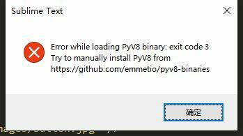
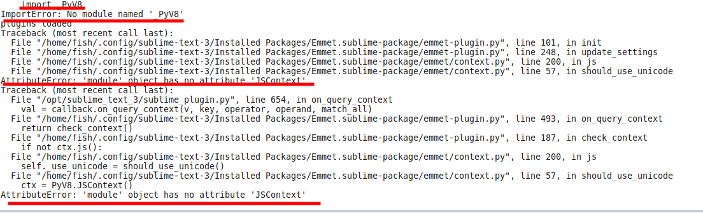
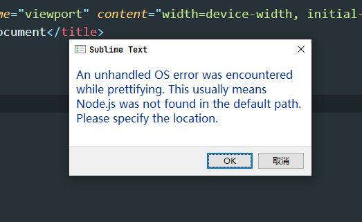

Title: sublime
Category: Tools
tags: linux
Date: 2020-9-03 10:20


# 一、安装
官网下载压缩包 :   [https://www.sublimetext.com/3](https://www.sublimetext.com/3)
## win
### 正常安装
windows 的安装下载包然后双击安装就好了，如果有自己之前的配置文件备份的话，复制到`C:\Users\aiyoy\AppData\Roaming\Sublime Text 3`即可。

### 便携版本
安装的时候选择一个比较容易找到的位置，默认的也可以，不过得去找到安装的位置，安装好之后先不要打开，在 Sublime Text 3 文件夹下新建一个  Data (注意大小写) 文件夹并删除 `C:\Users\aiyoy\AppData\Roaming\`下的 Sublime Text 3 文件夹，这时候启动安装插件就会在Data目录中了，也可以直接复制自己的配置文件到Data目录中

然后这个文件夹就可以复制进u盘随身带着了
## linux（manjaro）

### （1）手动下载安装


解压缩，将目录名改为sublime_text，移动到 `/opt/ `目录下

```
sudo mv sublime_text_3 sublime_text
sudo mv sublime_text /opt/
```

打开解压目录找到 .desktop 文件打开修改路径然后复制到相应的位置，或者电脑快捷方式所在的`/usr/share/applications`即可在应用管理器里面找到。

### （2）通过命令行安装

```
yay -S sublime-text-3
```

## mac

# 二、配置

## 安装 Package Control (插件管理工具)：

按 ctrl + ` 或者 View > Show Console ，打开 Console 一次性输入如下代码，回车：

```
import urllib.request,os,hashlib; h = '6f4c264a24d933ce70df5dedcf1dcaee' + 'ebe013ee18cced0ef93d5f746d80ef60'; pf = 'Package Control.sublime-package'; ipp = sublime.installed_packages_path(); urllib.request.install_opener( urllib.request.build_opener( urllib.request.ProxyHandler()) ); by = urllib.request.urlopen( 'http://packagecontrol.io/' + pf.replace(' ', '%20')).read(); dh = hashlib.sha256(by).hexdigest(); print('Error validating download (got %s instead of %s), please try manual install' % (dh, h)) if dh != h else open(os.path.join( ipp, pf), 'wb' ).write(by)
```
### 为 Package Control 设置代理
（不设置也可以正常使用，但是在安装插件及更新插件的时候会比较慢）

Prefrences --> Packages Settings  --> Package Control  --> Settngs 增添下面的代码
```
{
	"auto_upgrade": false,
	"bootstrapped": true,
	// proxy setting
	"http_proxy":"http://127.0.0.1:12333",
	"https_proxy":"http://127.0.0.1:12333",
	"in_process_packages":
	[
	],
	"install_missing": false,
	"installed_packages":
	[
		"Anaconda",
		"AutoPEP8",
		"Git",
		"Git blame",
		"Godef",
		"HTML-CSS-JS Prettify",
		"Package Control",
		"PackageResourceViewer",
		"SublimeCodeIntel"
	],
	"remove_orphaned": false,
}

```


## 插件：

### 安装方法：

#### 1、自动安装：

`Ctrl+Shift+P` 打开命令行模式，输入 pci（习惯性问题，输入 Package Control: Install Package 里面的有的字母的简写都会模糊匹配出来的），然后回车选择：`Package Control: Install Package` 。搜索插件名称即可自动安装，注意留意底部的安装进程，如果安装失败的话可以选择手动安装。

#### 2、手动安装

去 github 上或者你能找到的渠道下载相应的包。
如果插件是打包好的话复制到 Installed Packages下，是文件目录的话复制到 Packages文件夹下。

### 1、Web

#### emmet：

前端神器。一个可以极大提高 web 开发者 HTML 和 CSS 工作效率的工具箱组件。
在开发前端项目时，常常需要编写大量的 HTML/CSS代码，标签、属性等使用常规方式一个一个敲打效率极低。
还好有 Emmet，它提供了相对简单的语法规则。使得编写很少的代码就能生成预期，极大的提高了代码的编写效率，并且它还支持觉得多数的编辑器，查看更多。
[查看介绍](https://packagecontrol.io/packages/Emmet)

##### 问题一：

如下报错：



 因为下载下来的 PyV8 的包是一个文件夹，按照正常情况是放在 packages 下的，但是安装之后一直无法使用，以为是快捷键冲突，又是改快捷键、又是删除其余的包、又是重装、又是更换不同版本的 PyV8 的包的都没有解决，然后想着是不是包管理器给安装错误了，调出命令面板想重装一下，然后留意到加载emmet包然后加载 PyV8 插件的时候是报错，也就是包未加载成功。


最后终于找到解决方法：PyV8 包的位置应该是在与 emmet 包同级目录下。也就是` .config/sublime-text-3/Installed Packages/`下，而不是reference－－Browser Packages指定的`.config/sublime-text-3/Packages/`下。
解决方法：
	去提示的网址：https://github.com/emmetio/pyv8-binaries 下载相应的包，解压到里面的文件 `/home/fish/.config/sublime-text-3/Packages/PyV8`下，没有PyV8文件夹就创建一个（比如我的 `pyv8-linux64-p3`，或者我在测试的时候发现把里面的文件复制到 PyV8 里面也是可以的，但直接复制比较方便快捷，也易于下次区分是什么系统的文件），然后重启解决。

做完这些后不会弹窗报错了，但是启动的时候地下的任务栏都会提示加载 PyV8,调出命令板也是每次都会有提示，但那不是错误，而是其默认会在启动时检查并更新 PyV8，阻止PyV8 的更新设置方法是：Preferences->Packages Settings-->Emmet-->Settings User，修改 Emmet 的配置文件即可，内容是：
```
{"disable_pyv8_update":true}
```

使用方法：
https://docs.emmet.io/cheat-sheet/
https://code.z01.com/Emmet/

#### ColorHighLight
它可以展示你所选择的颜色代码（
像 “FFFFFF”, “rgb(255,255,255)”, “white”）的真正颜色。同时它还包含一个颜色选择器让你可以方便地更改颜色。


#### HTML-CSS-JS Prettify
有时候会报错

安装后需要配合nodejs使用所以需要安装nodejs并设置node的位置

如果想要改快捷键
Preferences->Key Bindings–User”里新增：
```
{
"keys": ["ctrl+shift+o"],
"command": "htmlprettify"
}
```
为了正常使用建议更改后测试一下是否有效，防止与其他的互相冲突

#### SideBarEnhancements
右键菜单增强插件
SideBarEnhancements是一款很实用的右键菜单增强插件，有以 diff 形式显示未保存的修改、在文件管理器中显示该文件、复制文件路径、在侧边栏中定位该文件等功能，也有基础的诸如新建文件/目录，编辑，打开/运行，显示，在选择中/上级目录/项目中查找，剪切，复制，粘贴，重命名，删除，刷新等常见功能。

Copy as Text... 是 SideBarEnhancements 的又一个特色功能，可以复制包含各种形式的路径、URL（甚至包括 base64 的 data:uri）、转码后的文件名、各种 HTML Tag（a、img、script、style）等

编辑快捷键在浏览器打开
Preferences->Key Bindings–User”里新增：
```
[
    // side_bar 设置快速在浏览器打开
    // chrome，请根据个人电脑修改浏览器路径
    {
        "keys": ["f1"],
        "command": "side_bar_files_open_with",
        "args": { "paths": [], "application":"C:/Program Files (x86)/Google/Chrome/Application/chrome.exe", "extensions":".*" }
    },
    // firefox
    {
        "keys": ["f2"],
        "command": "side_bar_files_open_with",
        "args": { "paths": [], "application": "C:/Program Files (x86)/Mozilla Firefox/firefox.exe", "extensions":".*" }
    },
    // Edge
    {
        "keys": ["f3"],
        "command": "side_bar_files_open_with",
        "args": { "paths": [], "application": "C:/Program Files (x86)/Microsoft/Edge/Application/msedge.exe", "extensions":".*" }
    },
    // IE
     {
        "keys": ["f4"],
        "command": "side_bar_files_open_with",
        "args": { "paths": [], "application": "C:/Program Files/Internet Explorer/iexplore.exe", "extensions":".*" }
    },
]

```

个人习惯不太喜欢这个，虽然增加了很多功能，但是很多实际上并不需要，且在linux的命令行下移动、改名、删除会更方便，就放弃使用了

#### AdvancedNewFile
用 Sublime text 新建文件的快捷键是，ctrl+ N会新建一个名为untitled的文件，CTRL+S 保存，然后在弹出的 Finder 中填写真正需要的文件名，然后点击 Save 。可谓很是麻烦，而且如果需要新建多层次的文件夹，则需要转换到 Finder 进入到相应的工程目录下，一层一层新建，操作步骤十分繁琐而且费事。

然而，如果用 AdvancedNewFile，一切将会变得十分简单。

ctrl+ art + N 即新建，然后 sublime text 底部会弹出一个文本输入框，只要在里面输入文件名，或多层次的路径，然后回车即可。
相应文件或多层次的路径就会立刻在工程目录下新建完成。
另外再输入的时候也支持tab补全操作。

#### AlignTab

使用正则表达式来帮助代码对齐，比如几行代码以=号对齐。
[查看介绍](https://packagecontrol.io/packages/AlignTab)

以上插件覆盖HTML，CSS，JavaScript，jQuery，CSS颜色显示，代码块级高亮，代码格式化，代码对齐，满足绝大多数前端的需求。

至于用Sass就装Sass，Sassbuild，git就下sublimeGit，git Gutter，想用某个主题就下主题，想扩展侧边栏就扩展侧边栏，这毕竟不是每个人必须的。

#### All Autocomplete
Sublime Text 默认的 Autocomplete 功能只考虑当前的文件，而 AllAutocomplete 插件会搜索所有打开的文件来寻找匹配的提示词。

-----

#### CSS3：

CSS3语法高亮、CSS语法提示，美中不足的是缺少游览器私有属性高亮。
[查看介绍](https://packagecontrol.io/packages/CSS3)

#### CSS Extended Completions：

关联CSS文件，智能提示css文件中的类名，非常好用。
[查看介绍](https://packagecontrol.io/packages/CSS Extended Completions)

#### JavaScript Completions

支持javascript原生语法提示，妈妈再也不用担心我输入document.getElementById(id)。
[查看介绍](https://packagecontrol.io/packages/JavaScript Completions)

#### jQuery

为jQuery的大部分方法提供了示例代码段，让jQuery的API更加容易使用。
[查看介绍](https://packagecontrol.io/packages/jQuery)

#### BracketHighlighter

括号以及标签层级显示，不用担心选中的代码属于哪个代码块，一目了然。
[查看介绍](https://packagecontrol.io/packages/BracketHighlighter)


这里再推荐一个主题插件，主题库比较丰富，感觉大多数人都能用上，避免视觉疲劳：


### 2、Markdown

不建议使用，无论是在软件中，还是在浏览器中打开的效果都不是很好。

|         插件         |                  功能                  |
| ------------------- | ------------------------------------- |
| MarkdownEditing     | 一个提高Sublime中Markdown编辑特性的插件   |
| MarkdownPreview     | Markdown转HTML，提供在浏览器中的预览功能   |
| MarkdownLivePreview | 提供在编辑框中实时预览的功能               |
| LiveReload          | 一个提供md/html等文档的实时刷新预览的的插件 |

记笔记需要用到markdown，但是单独打开一个应用的话没有必要也麻烦，干脆就配置sublime的环境吧
本次使用了 MarkdownEditing 和 MarkdownLivePreview 实现实时预览，其他的都需要在网页预览，与自己的需求不符

 MarkdownEditing安装后无需配置
 MarkdownLivePreview看以前的说是要改设置，但这次没有看到，官方给出的是添加快捷键去实现弹出窗口预览
```
 [
 // markdown预览
    {
    "keys": ["alt+m"],
    "command": "open_markdown_preview"
    }
]
```

### Python
#### AutoPep8：

python 开发规范 pep8
SublimeCodeIntel: 代码提示插件，可根据是python、java等自动代码提示（安装后没有找到合适的配置方法，感觉好像没生效，先搁置吧，提示补充代码anaconda感觉足够了）


### Go
### 4、Golang

目前只安装了Golang build和GoSublime，在都安装后在配置的时候先去配置了gosublime，但是无论怎么调都会报错，gopath无法被加载，后来删除了gosublime还存在这个问题才知道是golang build引起的，但是不知道是不是因为之前配置的gosubime的一些文件遗留下来了，单独golang build也会存在一些问题，目前也没办法也懒得去慢慢重置整个sublime环境去重现错误去一一解决了，等下一次找个其他的电脑或者啥的再去慢慢解决吧

#### Golang build

Preferences -> package settings -> Golang config-> Settings - Uesr，配置GOPATH，GOROOT

```
{
    "osx": {
        "PATH": "/Users/jsmith/go/bin",
        "GOPATH": "/Users/jsmith/go"
    },
    "windows": {
        "PATH": "C:\\Users\\jsmith\\go\\bin",
        "GOPATH": "C:\\Users\\jsmith\\go"
    },
    "linux": {
        "PATH": "/usr/lib/go/bin",
        "GOPATH": "/home/fish/go"
    },
}
```

#### GoSublime

不知道什么原因直接在sublime搜索不到这个插件，只能手动安装
https://github.com/DisposaBoy/GoSublime
下载后将整个目录复制到/home/fish/.config/sublime-text-3/Packages/下，将其Packages/GoSublime/src/margo.sh/extension-example/下的extension-example.go文件复制到GoSublime/src/margo/目录下，没有margo文件夹就创建一个

Preferences -> package settings -> GoSublime-> Settings - Uesr

```
{
    "env": {
        "GOPATH": "/home/fish/go",
        "GOROOT": "/usr/lib/go"
    }
}
```


# 三、美化：

@ 安装图标和主题的方式和安装插件一样

图标：A File Icon
主题：material theme

安装后preferences >> settings user输入配置
```
{
    // 主题、配色相关
   	"theme": "Material-Theme.sublime-theme", // 整体界面
   	"color_scheme": "Packages/Material Theme/schemes/Material-Theme.tmTheme", // 配色方案
    // "sidebar_no_icon": true,
    "sidebar_size_13": true,
    "sidebar_row_padding_medium": true,
    "folder_no_icon": true,
    "tabs_small": true,
    "tabs_padding_small": true,
    "tabs_padding_medium": true,
    // "tabs_label_not_italic": true,
    "status_bar_brighter": true,
    "color_inactive_tabs": true,

    // 整体设置
    // "font_face": "YaHei Consolas Hybrid",
    // "font_face": "Microsoft Yahei Mono", // 字体类型
    "font_size": 12.5, // 字号
    // "font_options": [ "gray_antialias" ], // On retina Mac
    "highlight_line": true, // 高亮当前行
    // "line_numbers": true, // 显示行号
    // "gutter": false, // 显示行号边栏
    // "margin": 0, // 行号边栏和文字的间距
    "line_padding_top": 2, // 行的上间距
    "line_padding_bottom": 2, // 行的下间距
    // "draw_white_space": "all", // 显示空白符
    "show_encoding": true, // 状态栏显示当前文件编码
    "always_show_minimap_viewport": true, // 右侧总是显示代码地图可视区域
    // "draw_minimap_border": true, // 显示可视区域部分的边框
    // "bold_folder_labels": true, // 左侧边栏文字加粗
    "indent_guide_options": [ "draw_normal", "draw_active" ], // 制表位的对齐线
    "remember_open_files": true, // 记忆之前打开的文件
    // "overlay_scroll_bars": "system",
    "dpi_scale": 1.0, // 高分屏必须调整此设置
    "show_full_path": true, // 标题栏显示打开文件的完整路径

    // 删除你想要忽略的插件，需要重启
    "ignored_packages":
    [
        "Vintage" // 是否禁用 vim 模式
    ],

    // 编辑行为
    "default_encoding": "UTF-8", // 默认编码格式
    "tab_size": 4,  // Tab键制表符宽度
    "translate_tabs_to_spaces": true, // 设为true时，缩进和遇到Tab键时使用空格替代
    "scroll_past_end": false, // 设置为false时，滚动到文本的最下方时，没有缓冲区
    // "highlight_modified_tabs": true, // 高亮内容有修改的标签
    // "find_selected_text": true, // 匹配选中的文本
    "trim_trailing_white_space_on_save": true, // 保存文件时是否删除每行结束后多余的空格
    // "ensure_newline_at_eof_on_save": false,  // 保存文件时光标是否在文件的最后向下换一行
    // "save_on_focus_lost": false, // 切换到其它文件标签或点击其它非本软件区域，文件是否自动保存
    // "auto_close_tags": true, // 自动闭合标签
    // "tab_completion": true,
    // "auto_complete": true, // 代码提示
    // "auto_complete_delay": 50, // 代码提示延迟显示
    "auto_complete_triggers": [ // 设置触发代码提醒的关键字
        {
            "selector": "text.html",
            "characters": "abcdefghijklmnopqrstuvwxyzABCDEFGHIJKLMNOPQRSTUVWXYZ.<"
        },
        {
            "selector": "text.xml",
            "characters": "abcdefghijklmnopqrstuvwxyzABCDEFGHIJKLMNOPQRSTUVWXYZ.<"
        },
        {
            "selector": "text.php",
            "characters": "abcdefghijklmnopqrstuvwxyzABCDEFGHIJKLMNOPQRSTUVWXYZ.<"
        },
        {
            "selector": "text.css",
            "characters": "abcdefghijklmnopqrstuvwxyzABCDEFGHIJKLMNOPQRSTUVWXYZ.<"
        },
        {
            "selector": "text.js",
            "characters": "abcdefghijklmnopqrstuvwxyzABCDEFGHIJKLMNOPQRSTUVWXYZ.<"
        }
    ],
    // "auto_match_enabled": true, // 自动匹配引号，括号等

    // 光标样式
    "caret_style": "smooth", // 光标闪动方式 "smooth", "phase", "blink", "wide" and "solid"
    "caret_extra_bottom": 1,
    "caret_extra_top": 1,
    "caret_extra_width": 1,

    // Word wrapping - follow PEP 8 recommendations
    // "rulers": [ 82, 92 ],
    // "wrap_width": 80, // 设置窗口内文字区域的宽度
    "word_wrap": false, // true | false | auto

    // 禁止自动更新
    "update_check": false
}
```

# 四、汉化：

​Ctrl+Shift+P打开命令行模式，输入pci，然后回车选择：Package Control: Install Package。

​稍等一会，在弹出的下拉菜单输入”ChineseLocalization”,help >> language 进行语言切换

# 五、破解
## 1、

2020-6-6日测试可用。

```
sudo nano /etc/hosts  #添加如下内容到文件里面
127.0..0.1 www.sublimetext.com
127.0.0.1 license.sublimehq.com
127.0.0.1 45.55.255.55
127.0.0.1 45.55.41.223
```

注册码：

```
  ZYNGA INC.
  50 User License
  EA7E-811825
  927BA117 84C9300F 4A0CCBC4 34A56B44
  985E4562 59F2B63B CCCFF92F 0E646B83
  0FD6487D 1507AE29 9CC4F9F5 0A6F32E3
  0343D868 C18E2CD5 27641A71 25475648
  309705B3 E468DDC4 1B766A18 7952D28C
  E627DDBA 960A2153 69A2D98A C87C0607
  45DC6049 8C04EC29 D18DFA40 442C680B
  1342224D 44D90641 33A3B9F2 46AADB8F
```
由于这个是一个Sublime Text 2的验证码，注册成功后会弹出提示说这个注册码是Sublime Text 2的，是否要升级之类的，选择取消就好了，接下来就可以正常使用了。
    最后的最后，我觉得还是应该支持正版，拒绝盗版，条件允许的情况下还是建议购买官方注册码。

## 2、
上面的方法在linux的时候可用，但是在 win 的时候不成功，找了另一个方法
### 改hosts：
加上下面这段代码：

```
127.0.0.1    www.sublimetext.com
127.0.0.1    sublimetext.com
127.0.0.1    sublimehq.com
127.0.0.1    license.sublimehq.com
127.0.0.1    45.55.255.55
127.0.0.1    45.55.41.223
0.0.0.0     license.sublimehq.com
```
### 输入注册码：
一定要改一下hosts在输入注册码，否则可能失败。Help->enter license,复制粘贴下列全部粘贴至打开的对话框。

```
----- BEGIN LICENSE -----
Member J2TeaM
Single User License
EA7E-1011316
D7DA350E 1B8B0760 972F8B60 F3E64036
B9B4E234 F356F38F 0AD1E3B7 0E9C5FAD
FA0A2ABE 25F65BD8 D51458E5 3923CE80
87428428 79079A01 AA69F319 A1AF29A4
A684C2DC 0B1583D4 19CBD290 217618CD
5653E0A0 BACE3948 BB2EE45E 422D2C87
DD9AF44B 99C49590 D2DBDEE1 75860FD2
8C8BB2AD B2ECE5A4 EFC08AF2 25A9B864
------ END LICENSE ------
```
接下来应该是显示激活成功，激活成功后可将之前hosts文件添加内容删掉

### 设置软件不更新：
菜单栏->preferences->settings,在右侧代码框里添加下面这句代码

"update_check":false

# 六、其他：
包管理自定义设置：Preferences > Package Setting > Package Control > Setting User
主要是禁止自动删除手动安装的包

```
{
	// 是否自动更新
	"auto_upgrade": false,

	// 暂时不知道这个是干嘛的，先留着吧
	"bootstrapped": true,

	// 包丢失自动下载安装
	"install_missing": false,

	// If a package was installed by Package Control (has a
	// package-metadata.json file) but is not in installed_packages, remove it
	// based upon the assumption that it was removed on another machine and
	// the Package Control.sublime-settings file was synced to this machine.
	"remove_orphaned": false
}

```

```
4、常用快捷键（默认）
Ctrl+Shift+P：打开命令面板
Ctrl+P：搜索项目中的文件
Ctrl+G：跳转到第几行
Ctrl+W：关闭当前打开文件
Ctrl+Shift+W：关闭所有打开文件
Ctrl+Shift+V：粘贴并格式化
Ctrl+D：选择单词，重复可增加选择下一个相同的单词
Ctrl+L：选择行，重复可依次增加选择下一行
Ctrl+Shift+L：选择多行
Ctrl+Shift+Enter：在当前行前插入新行
Ctrl+X：删除当前行
Ctrl+M：跳转到对应括号
Ctrl+U：软撤销，撤销光标位置
Ctrl+J：选择标签内容
Ctrl+F：查找内容
Ctrl+Shift+F：查找并替换
Ctrl+H：替换
Ctrl+R：前往 method
Ctrl+N：新建窗口
Ctrl+K+B：开关侧栏
Ctrl+Shift+M：选中当前括号内容，重复可选着括号本身
Ctrl+F2：设置/删除标记
Ctrl+/：注释当前行
Ctrl+Shift+/：当前位置插入注释
Ctrl+Alt+/：块注释，并Focus到首行，写注释说明用的
Ctrl+Shift+A：选择当前标签前后，修改标签用的
F11：全屏
Shift+F11：全屏免打扰模式，只编辑当前文件
Alt+F3：选择所有相同的词
Alt+.：闭合标签
Alt+Shift+数字：分屏显示
Alt+数字：切换打开第N个文件
Shift+右键拖动：光标多不，用来更改或插入列内容
鼠标的前进后退键可切换Tab文件
按Ctrl，依次点击或选取，可需要编辑的多个位置
按Ctrl+Shift+上下键，可替换行
```

