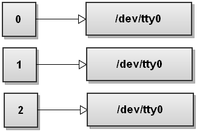
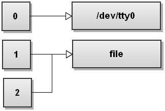
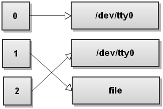

Title: Bash输出重定向
Date: 2017-07-09 15:20
Category: Note
Tags: bash, linux

对 bash 命令一直不太熟，每次使用 nohup 命令都要从网上现找。
有时会看到一些命令后面跟着 `"2>&1"` 的参数。比如

	nohupy python test.py > test.log 2>&1

之前也没有多管，直接用了。前几天又在其他人的 shell 脚本中看到 `"2>&1"`, 才想起去了解一下 ，现把内容整理一下做记录。

主要内容借鉴于[Bash One-Liners Explained, Part III: All about redirections - good coders code, great coders reuse](http://www.catonmat.net/blog/bash-one-liners-explained-part-three/)，原文非常详细，欢迎访问原文。

当 bash 启动时，会开启三个标准文件描述符：stdin, stdout, stderr。

它们都指向了 `/dev/tty0` 即我们当前使用的控制台。 `0` 代表 stdin， `1` 代表 stdout, `2` 代表stderr。

当我们输入一个命令：

	python test.py > file

`>` 就是输出重定向运算符，bash 首先会以写的形式打开 `file`，成功后上述命令的 stdout 就会被发送到这个打开的 `file` 中。如果打开失败，则整个命令失败。

`python test.py > file` 命令等同于 `python test.py 1>file`，因为 `1` 就代表标准输出 `stdout`。这个时候的文件描述符指向如下：

那么 `2>&1` 代表什么呢，它代表的是，将 `2` 所在文件描述符指向 `1` 所指向的内容。 如果 `1` 此时指向的是 `file`， 那么 `2` 也指向同一个 `file`。如下图所示：

另外命令`python test.py &> file `可以实现与 `2>&1` 一样的效果， `&>` 运算符指的是同时把命令的 stdout 和 stderr 重定向到同一个 `file`中。

**注意：重定向命令的参数是受顺序影响的！**

比如： 

	python test.py > file 2>&1

和命令

	python test.py 2>&1 >file

是不一样的。

第一个命令的效果是：

但是第二个命令的效果是：

